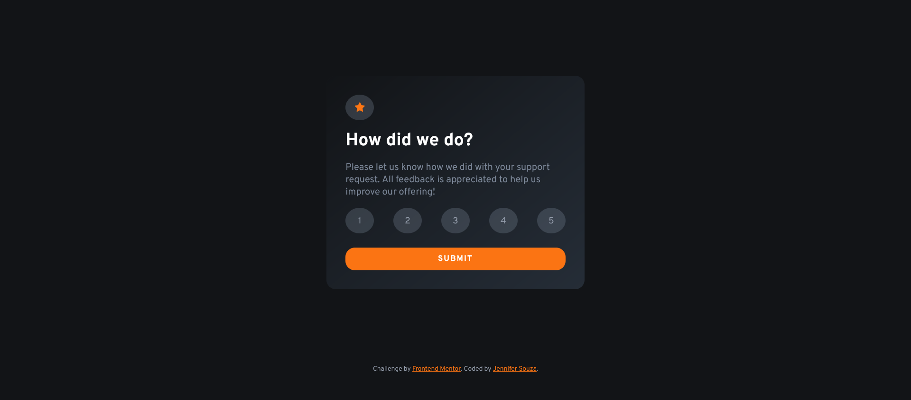

# Frontend Mentor - Interactive rating component solution

This is a solution to the [Interactive rating component challenge on Frontend Mentor](https://www.frontendmentor.io/challenges/interactive-rating-component-koxpeBUmI). Frontend Mentor challenges help you improve your coding skills by building realistic projects. 

## Table of contents

- [Overview](#overview)
  - [The challenge](#the-challenge)
  - [Screenshot](#screenshot)
  - [Links](#links)
- [My process](#my-process)
  - [Built with](#built-with)
  - [What I learned](#what-i-learned)
  - [Continued development](#continued-development)
  - [Useful resources](#useful-resources)
- [Author](#author)

## Overview

### The challenge

Users should be able to:

- View the optimal layout for the app depending on their device's screen size
- See hover states for all interactive elements on the page
- Select and submit a number rating
- See the "Thank you" card state after submitting a rating

### Screenshot

### Links

- Solution URL: [https://github.com/zoedarkweather/interactive-rating-component](https://github.com/zoedarkweather/interactive-rating-component)
- Live Site URL: [https://interactive-rating-component-lime-pi.vercel.app/](https://interactive-rating-component-lime-pi.vercel.app/)

## My process

### Built with

- Semantic HTML5 markup
- CSS custom properties
- Flexbox
- Mobile-first workflow
- JavaScript

### What I learned

I'd just completed several relevant sections of the MDN Frontend Developer Course - Advanced Form Styling, UI Pseudo Classes, and Client-side Validation, so this was an opportunity to practice some of the things I've learned. I used radio buttons for the rating options as that seemed to make the most sense and be the most accessable way to do it. I had difficulty styling them at first and then I realized I should style the labels instead. I'm not sure if this was the correct way to do it, so any feedback on those choices would be helpfuls.

### Continued development

Continue practicing styling form elements. 

### Useful resources

- [MDN - Advance Form Styling](https://developer.mozilla.org/en-US/docs/Learn/Forms/Advanced_form_styling) - This chapter helped me learn how to remove default styling from form controls.

## Author

- Github - [https://github.com/zoedarkweather](https://github.com/zoedarkweather)
- Frontend Mentor - [@zoedarkweather](https://www.frontendmentor.io/profile/zoedarkweather)

